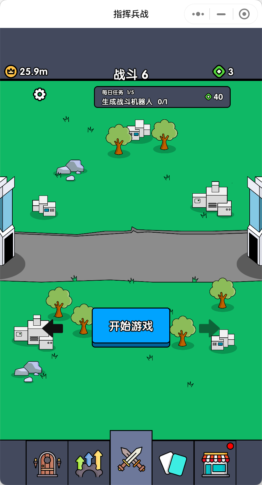

# 游戏美术资源拆解（GPT4o）

`内容太多，还没看，但是PUA他的过程来看，他有点蠢，可能是文本过长，超过了他的适应范围。`

## 界面1拆解 

---

图片名称：top_bar_background
图片尺寸：1080 x 100
图片描述：顶部栏的背景图片，包含游戏标题和装饰元素。

---

图片名称：currency_icon
图片尺寸：50 x 50
图片描述：货币图标，显示当前货币数量。

---

图片名称：currency_amount
图片尺寸：100 x 50
图片描述：货币数量的显示区域，显示当前货币数量。此区域需要动态更新。

---

图片名称：resource_icon
图片尺寸：50 x 50
图片描述：资源图标，显示当前资源数量。

---

图片名称：resource_amount
图片尺寸：100 x 50
图片描述：资源数量的显示区域，显示当前资源数量。此区域需要动态更新。

---

图片名称：dungeon_title
图片尺寸：200 x 50
图片描述：地牢标题的显示区域，显示当前地牢模式的名称。

---

图片名称：zombie_attack_card
图片尺寸：600 x 200
图片描述：僵尸攻击卡片的背景图片，包含僵尸攻击的图标、文字描述和进入按钮。

---

图片名称：zombie_attack_icon
图片尺寸：50 x 50
图片描述：僵尸攻击的图标，显示僵尸攻击的相关图像。

---

图片名称：zombie_attack_text
图片尺寸：200 x 50
图片描述：僵尸攻击的文字描述区域，显示僵尸攻击的名称和描述。

---

图片名称：key_icon
图片尺寸：50 x 50
图片描述：钥匙图标，显示当前钥匙数量。

---

图片名称：key_amount
图片尺寸：100 x 50
图片描述：钥匙数量的显示区域，显示当前钥匙数量。此区域需要动态更新。

---

图片名称：enter_button_normal
图片尺寸：100 x 50
图片描述：“进入”按钮的普通状态，按钮上有“进入”文字。按钮可互动，需要有悬停和点击状态。

---

图片名称：enter_button_hover
图片尺寸：100 x 50
图片描述：“进入”按钮的悬停状态，按钮上有“进入”文字。按钮可互动，需要有点击状态。

---

图片名称：enter_button_pressed
图片尺寸：100 x 50
图片描述：“进入”按钮的点击状态，按钮上有“进入”文字。

---

图片名称：locked_card_1
图片尺寸：600 x 200
图片描述：锁定卡片1的背景图片，包含锁定图标和文字描述。

---

图片名称：locked_icon_1
图片尺寸：50 x 50
图片描述：锁定图标1，显示锁定状态的图像。

---

图片名称：locked_text_1
图片尺寸：200 x 50
图片描述：锁定卡片1的文字描述区域，显示锁定状态的名称和描述。

---

图片名称：locked_card_2
图片尺寸：600 x 200
图片描述：锁定卡片2的背景图片，包含锁定图标和文字描述。

---

图片名称：locked_icon_2
图片尺寸：50 x 50
图片描述：锁定图标2，显示锁定状态的图像。

---

图片名称：locked_text_2
图片尺寸：200 x 50
图片描述：锁定卡片2的文字描述区域，显示锁定状态的名称和描述。

---

图片名称：bottom_bar_background
图片尺寸：1080 x 100
图片描述：底部栏的背景图片，包含多个功能按钮。

---

图片名称：dungeon_button_normal
图片尺寸：100 x 100
图片描述：底部栏“地牢”按钮的普通状态，按钮上有地牢图标。按钮可互动，需要有悬停和点击状态。

---

图片名称：dungeon_button_hover
图片尺寸：100 x 100
图片描述：底部栏“地牢”按钮的悬停状态，按钮上有地牢图标。按钮可互动，需要有点击状态。

---

图片名称：dungeon_button_pressed
图片尺寸：100 x 100
图片描述：底部栏“地牢”按钮的点击状态，按钮上有地牢图标。

---

图片名称：upgrade_button_normal
图片尺寸：100 x 100
图片描述：底部栏“升级”按钮的普通状态，按钮上有升级图标。按钮可互动，需要有悬停和点击状态。

---

图片名称：upgrade_button_hover
图片尺寸：100 x 100
图片描述：底部栏“升级”按钮的悬停状态，按钮上有升级图标。按钮可互动，需要有点击状态。

---

图片名称：upgrade_button_pressed
图片尺寸：100 x 100
图片描述：底部栏“升级”按钮的点击状态，按钮上有升级图标。

---

图片名称：battle_button_normal
图片尺寸：100 x 100
图片描述：底部栏“战斗”按钮的普通状态，按钮上有战斗图标。按钮可互动，需要有悬停和点击状态。

---

图片名称：battle_button_hover
图片尺寸：100 x 100
图片描述：底部栏“战斗”按钮的悬停状态，按钮上有战斗图标。按钮可互动，需要有点击状态。

---

图片名称：battle_button_pressed
图片尺寸：100 x 100
图片描述：底部栏“战斗”按钮的点击状态，按钮上有战斗图标。

---

图片名称：card_button_normal
图片尺寸：100 x 100
图片描述：底部栏“卡牌”按钮的普通状态，按钮上有卡牌图标。按钮可互动，需要有悬停和点击状态。

---

图片名称：card_button_hover
图片尺寸：100 x 100
图片描述：底部栏“卡牌”按钮的悬停状态，按钮上有卡牌图标。按钮可互动，需要有点击状态。

---

图片名称：card_button_pressed
图片尺寸：100 x 100
图片描述：底部栏“卡牌”按钮的点击状态，按钮上有卡牌图标。

---

图片名称：shop_button_normal
图片尺寸：100 x 100
图片描述：底部栏“商店”按钮的普通状态，按钮上有商店图标。按钮可互动，需要有悬停和点击状态。

---

图片名称：shop_button_hover
图片尺寸：100 x 100
图片描述：底部栏“商店”按钮的悬停状态，按钮上有商店图标。按钮可互动，需要有点击状态。

---

图片名称：shop_button_pressed
图片尺寸：100 x 100
图片描述：底部栏“商店”按钮的点击状态，按钮上有商店图标。

---

## 界面2-1拆解 

---

图片名称：upgrade_title
图片尺寸：200 x 50
图片描述：升级标题的显示区域，显示当前升级模式的名称。

---

图片名称：robot_card
图片尺寸：200 x 300
图片描述：机器人卡片的背景图片，包含机器人图标和文字描述。

---

图片名称：robot_icon
图片尺寸：100 x 100
图片描述：机器人的图标，显示机器人相关图像。

---

图片名称：robot_text
图片尺寸：100 x 50
图片描述：机器人卡片的文字描述区域，显示机器人的名称。

---

图片名称：drone_card
图片尺寸：200 x 300
图片描述：无人机卡片的背景图片，包含无人机图标和文字描述。

---

图片名称：drone_icon
图片尺寸：100 x 100
图片描述：无人机的图标，显示无人机相关图像。

---

图片名称：drone_text
图片尺寸：100 x 50
图片描述：无人机卡片的文字描述区域，显示无人机的名称。

---

图片名称：battle_robot_card
图片尺寸：200 x 300
图片描述：战斗机器人卡片的背景图片，包含战斗机器人图标和文字描述。

---

图片名称：battle_robot_icon
图片尺寸：100 x 100
图片描述：战斗机器人的图标，显示战斗机器人相关图像。

---

图片名称：battle_robot_text
图片尺寸：100 x 50
图片描述：战斗机器人卡片的文字描述区域，显示战斗机器人的名称。

---

图片名称：food_supply_icon
图片尺寸：50 x 50
图片描述：食物供应图标，显示当前食物供应状态。

---

图片名称：food_supply_text
图片尺寸：100 x 50
图片描述：食物供应的文字描述区域，显示食物供应的名称和状态。

---

图片名称：food_supply_amount
图片尺寸：100 x 50
图片描述：食物供应数量的显示区域，显示当前食物供应数量。此区域需要动态更新。

---

图片名称：base_health_icon
图片尺寸：50 x 50
图片描述：基地血量图标，显示当前基地血量状态。

---

图片名称：base_health_text
图片尺寸：100 x 50
图片描述：基地血量的文字描述区域，显示基地血量的名称和状态。

---

图片名称：base_health_amount
图片尺寸：100 x 50
图片描述：基地血量数量的显示区域，显示当前基地血量数量。此区域需要动态更新。

---

图片名称：upgrade_button_normal
图片尺寸：200 x 100
图片描述：“升级”按钮的普通状态，按钮上有“升级”文字。按钮可互动，需要有悬停和点击状态。

---

图片名称：upgrade_button_hover
图片尺寸：200 x 100
图片描述：“升级”按钮的悬停状态，按钮上有“升级”文字。按钮可互动，需要有点击状态。

---

图片名称：upgrade_button_pressed
图片尺寸：200 x 100
图片描述：“升级”按钮的点击状态，按钮上有“升级”文字。

---

图片名称：evolve_button_normal
图片尺寸：200 x 100
图片描述：“进化”按钮的普通状态，按钮上有“进化”文字。按钮可互动，需要有悬停和点击状态。

---

图片名称：evolve_button_hover
图片尺寸：200 x 100
图片描述：“进化”按钮的悬停状态，按钮上有“进化”文字。按钮可互动，需要有点击状态。

---

图片名称：evolve_button_pressed
图片尺寸：200 x 100
图片描述：“进化”按钮的点击状态，按钮上有“进化”文字。

---

## 界面2-2拆解 

---

图片名称：evolve_title
图片尺寸：200 x 50
图片描述：进化标题的显示区域，显示当前进化模式的名称。

---

图片名称：time_machine_icon
图片尺寸：300 x 400
图片描述：时间机器的图标，显示时间机器相关图像。

---

图片名称：timeline_text
图片尺寸：200 x 50
图片描述：时间线文字描述区域，显示当前时间线的名称和描述。

---

图片名称：warp_button_normal
图片尺寸：200 x 100
图片描述：“穿越”按钮的普通状态，按钮上有“穿越”文字。按钮可互动，需要有悬停和点击状态。

---

图片名称：warp_button_hover
图片尺寸：200 x 100
图片描述：“穿越”按钮的悬停状态，按钮上有“穿越”文字。按钮可互动，需要有点击状态。

---

图片名称：warp_button_pressed
图片尺寸：200 x 100
图片描述：“穿越”按钮的点击状态，按钮上有“穿越”文字。

---

图片名称：warp_note_text
图片尺寸：400 x 50
图片描述：穿越说明文字描述区域，显示穿越的条件和提示。

---

## 界面3拆解 

---

图片名称：battle_title
图片尺寸：200 x 50
图片描述：战斗标题的显示区域，显示当前战斗模式的名称。

---

图片名称：settings_button
图片尺寸：50 x 50
图片描述：设置按钮，点击后可以进入设置界面。按钮可互动，需要有悬停和点击状态。

---

图片名称：daily_task
图片尺寸：300 x 100
图片描述：每日任务的显示区域，显示当前每日任务的名称和进度。此区域需要动态更新。

---

图片名称：start_game_button_normal
图片尺寸：200 x 100
图片描述：“开始游戏”按钮的普通状态，按钮上有“开始游戏”文字。按钮可互动，需要有悬停和点击状态。

---

图片名称：start_game_button_hover
图片尺寸：200 x 100
图片描述：“开始游戏”按钮的悬停状态，按钮上有“开始游戏”文字。按钮可互动，需要有点击状态。

---

图片名称：start_game_button_pressed
图片尺寸：200 x 100
图片描述：“开始游戏”按钮的点击状态，按钮上有“开始游戏”文字。

---

## 界面4拆解 

---

图片名称：card_collection_title
图片尺寸：200 x 50
图片描述：卡牌收藏标题的显示区域，显示当前卡牌收藏模式的名称。

---

图片名称：card_background
图片尺寸：200 x 300
图片描述：卡牌的背景图片，包含卡牌图标和文字描述。

---

图片名称：card_icon
图片尺寸：100 x 100
图片描述：卡牌的图标，显示卡牌相关图像。

---

图片名称：card_text
图片尺寸：100 x 50
图片描述：卡牌的文字描述区域，显示卡牌的名称。

---

图片名称：filter_button_normal
图片尺寸：100 x 50
图片描述：“筛选”按钮的普通状态，按钮上有“筛选”文字。按钮可互动，需要有悬停和点击状态。

---

图片名称：filter_button_hover
图片尺寸：100 x 50
图片描述：“筛选”按钮的悬停状态，按钮上有“筛选”文字。按钮可互动，需要有点击状态。

---

图片名称：filter_button_pressed
图片尺寸：100 x 50
图片描述：“筛选”按钮的点击状态，按钮上有“筛选”文字。

---

图片名称：sort_button_normal
图片尺寸：100 x 50
图片描述：“排序”按钮的普通状态，按钮上有“排序”文字。按钮可互动，需要有悬停和点击状态。

---

图片名称：sort_button_hover
图片尺寸：100 x 50
图片描述：“排序”按钮的悬停状态，按钮上有“排序”文字。按钮可互动，需要有点击状态。

---

图片名称：sort_button_pressed
图片尺寸：100 x 50
图片描述：“排序”按钮的点击状态，按钮上有“排序”文字。

---

图片名称：card_detail_panel
图片尺寸：400 x 600
图片描述：卡牌详情面板，显示选中卡牌的详细信息。

---

图片名称：close_button_normal
图片尺寸：50 x 50
图片描述：“关闭”按钮的普通状态，按钮上有“关闭”图标。按钮可互动，需要有悬停和点击状态。

---

图片名称：close_button_hover
图片尺寸：50 x 50
图片描述：“关闭”按钮的悬停状态，按钮上有“关闭”图标。按钮可互动，需要有点击状态。

---

图片名称：close_button_pressed
图片尺寸：50 x 50
图片描述：“关闭”按钮的点击状态，按钮上有“关闭”图标。

---

## 界面5拆解 

---

图片名称：shop_title
图片尺寸：200 x 50
图片描述：商店标题的显示区域，显示当前商店模式的名称。

---

图片名称：item_card
图片尺寸：200 x 300
图片描述：物品卡片的背景图片，包含物品图标和文字描述。

---

图片名称：item_icon
图片尺寸：100 x 100
图片描述：物品的图标，显示物品相关图像。

---

图片名称：item_text
图片尺寸：100 x 50
图片描述：物品卡片的文字描述区域，显示物品的名称和价格。

---

图片名称：buy_button_normal
图片尺寸：100 x 50
图片描述：“购买”按钮的普通状态，按钮上有“购买”文字。按钮可互动，需要有悬停和点击状态。

---

图片名称：buy_button_hover
图片尺寸：100 x 50
图片描述：“购买”按钮的悬停状态，按钮上有“购买”文字。按钮可互动，需要有点击状态。

---

图片名称：buy_button_pressed
图片尺寸：100 x 50
图片描述：“购买”按钮的点击状态，按钮上有“购买”文字。

---

图片名称：currency_display
图片尺寸：200 x 50
图片描述：货币显示区域，显示当前货币数量。此区域需要动态更新。

---

图片名称：back_button_normal
图片尺寸：100 x 50
图片描述：“返回”按钮的普通状态，按钮上有“返回”文字。按钮可互动，需要有悬停和点击状态。

---

图片名称：back_button_hover
图片尺寸：100 x 50
图片描述：“返回”按钮的悬停状态，按钮上有“返回”文字。按钮可互动，需要有点击状态。

---

图片名称：back_button_pressed
图片尺寸：100 x 50
图片描述：“返回”按钮的点击状态，按钮上有“返回”文字。

---
